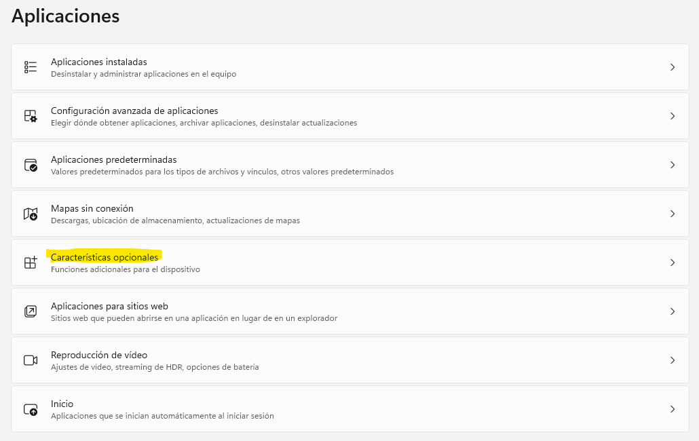
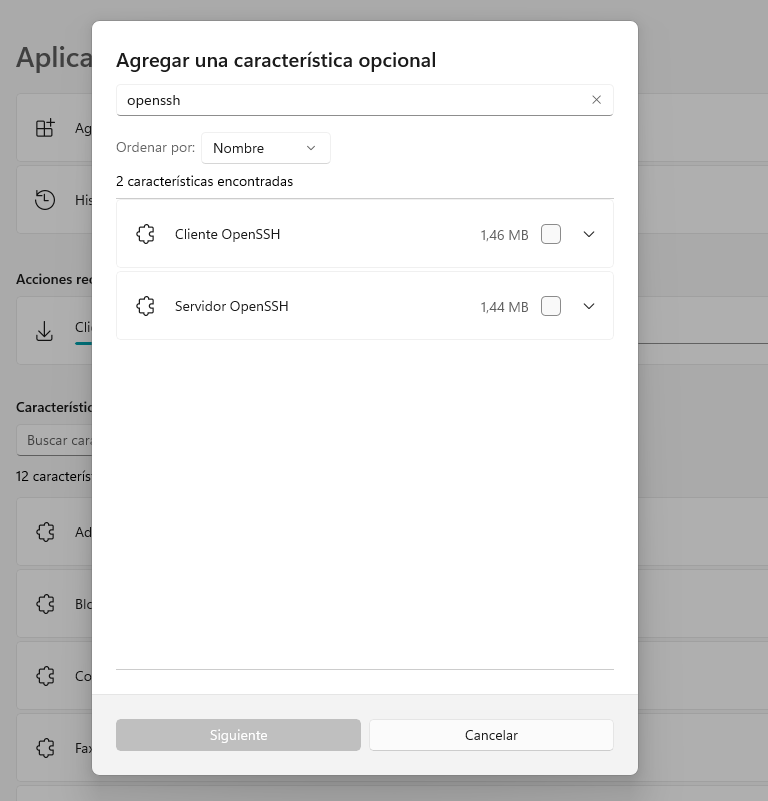

# Instalación y configuración de OpenSSH en Windows

## Instalación

OpenSSH se encuentra disponible como una característica desde Windows 10 y Windows Server 2019. Para versiones anteriores consultar la [versión portable](https://github.com/PowerShell/OpenSSH-Portable).

Para instalarlo debemos ir a **Configuración > Aplicaciones > Características opcionales**:



A continuación pulsamos el botón **Ver características** e introducimos en el cuadro de búsqueda `OpenSSH`:



Seleccionamos el cliente y/o el servidor, pulsamos **Siguiente** y luego **Instalar**. Cuando el proceso termine y ya tendremos instaladas las características seleccionadas.

El servidor OpenSSH se debe configurar como un servicio de Windows y/o iniciar manualmente, siguiendo los siguientes pasos:

```powershell
# Iniciar el servicio sshd
Start-Service sshd

# Hacer que el servicio inicie automáticamente (opcional pero recomendable)
Set-Service -Name sshd -StartupType 'Automatic'

# Confirmar que hay una regla en el Firewall que permite las conexiones SSH
# (en principio, al instalar el servicio se configura automáticamente esta regla)
if (!(Get-NetFirewallRule -Name "OpenSSH-Server-In-TCP" -ErrorAction SilentlyContinue | Select-Object Name, Enabled)) {
    Write-Output "Firewall Rule 'OpenSSH-Server-In-TCP' does not exist, creating it..."
    New-NetFirewallRule -Name 'OpenSSH-Server-In-TCP' -DisplayName 'OpenSSH Server (sshd)' -Enabled True -Direction Inbound -Protocol TCP -Action Allow -LocalPort 22
} else {
    Write-Output "Firewall rule 'OpenSSH-Server-In-TCP' has been created and exists."
}
```

## Autenticación basada en contraseñas

[TODO]

## Autenticación basada en certificados

[TODO]

## Referencias

- [Instalación de OpenSSH | Microsoft Learn](https://learn.microsoft.com/es-es/windows-server/administration/openssh/openssh_install_firstuse)
