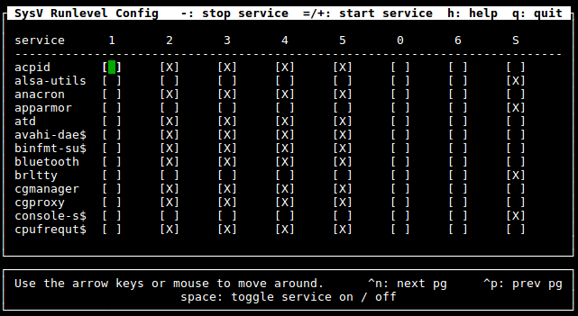

## Servicio

* En nomenclatura UNIX se denomina demonio (daemon; origen: “Disk And Execution MONitor”). 
* Es un tipo de proceso no interactivo que se ejecuta en segundo plano.
* No hacen uso de las entradas y salidas estándar
* Normalmente estos procesos son iniciados por el propio sistema al arrancar y detenidos al apagar (en concreto por el proceso “init”).
* Aunque el usuario también puede iniciarlos o detenerlos.
* Tradicionalmente estos procesos son comandos cuyo nombre acaba en “d” (httpd, sshd, syslogd, atd, ...).

## El proceso init

* Es el primer proceso iniciado por el sistema operativo tras cargarse el Kernel.
* Su binario se encuentra en `/sbin/init`.
* Su PID (identificador de proceso) es el 1.
* ¿Qué hace el proceso “init”?
  * Comprueba y monta los sistemas de ficheros
  * Activa la memoria SWAP o de intercambio
  * Inicia los servicios del sistema 
  * Activa la red
  * Inicia los servicios de red (correo electrónico, web, …)
  * Limpia los sistemas de ficheros temporales
  * Habilita el “login” para que los usuarios puedan iniciar sesión
* El proceso “init” se inicia con una configuración determinada por lo que se denomina nivel de ejecución (runlevel).
## Nivel de ejecución
* El nivel de ejecución o runlevel le indica al proceso “init” como iniciar el sistema.
* Hay hasta 7 niveles de ejecución (del 0 al 6).
* Para conocer el nivel de ejecución actual ejecutamos el comando “runlevel”
```bash
$ runlevel
```
* Para cambiar el nivel de ejecución disponemos del comando “telinit”:
```bash
# telinit <runlevel>
```
Donde "runlevel" es el nivel de ejecución al que se quiere cambiar.

Por ejemplo: para cambiar al nivel de ejecución 0 (apagar el equipo):

```bash
# telinit 0
```

### Niveles de ejecución

Los niveles de ejecución suelen ser los siguientes, aunque pueden variar de una distribución a otra:

| Runlevel | Descripción                              |
| -------- | ---------------------------------------- |
| 0        | Apagar el equipo.                        |
| 1 ó S    | Modo monousuario. Sólo usuario “root”. Para tareas de mantenimiento. |
| 2        | Modo multiusuario sin soporte de red.    |
| 3        | Modo multiusuario con soporte de red.    |
| 4        | Modo multiusuario con soporte de red (personalizable). |
| 5        | Modo multiusuario con servidor gráfico y soporte de red (modo normal). |
| 6        | Reiniciar el equipo.                     |

### Caso práctico del uso de los niveles de ejecución

* Disponemos de un equipo al quepodemos dar diferentes usos (y más si la máquina está escasa de recursos). 
* Ejemplos prácticos:
  * **PC de escritorio**: Usamos el runlevel 5 (con el servidor gráfico, etc.)
  * **Servidor de red**: Usamos el runlevel 3 (podemos quitar servicios que no se usen). 
  * **Servicios mínimos**: Nos interesa que se cargue elmínimo de servicios posibles para optimizar el rendimiento al máximo; por lo que podemos modificar el runlevel 4 para que no cargue los servicios que no queramos (red y sistema).
* Así, si nos interesa que la máquina sólo funcione como servidor, la configuraríamos para que inicie en runlevel 3, y lo mismo con las otras opciones.

## Estilos de inicio

Los estilos de inicio más habituales en GNU/Linux son los siguientes:

* **[SysV](#systemv)**: derivado del sistema UNIX System V. Es el estilo de inicio clásico.
* **[Upstart](#upstart)**: implementado para Ubuntu (y sus derivados) por Canonical.
* **[SystemD](#systemd)**: sistema de inicio adoptado actualmente por la mayoría de las distribuciones GNU/Linux.

### SystemV

* También se le denomina SysV.
* El proceso “init” lee el fichero `/etc/inittab` cuando se inicia el sistema y así sabe lo que tiene que hacer.
* Entre sus tareas está ejecutar el script rc.
* El directorio `/etc/init.d` contiene scripts que inician los servicios.
* Los directorios `/etc/rc#.d` corresponden a cada nivel de ejecución (0-6): 
  * Cada uno contiene enlaces simbólicos a los scripts de `/etc/init.d`. 
  * Los enlaces que empiezan por “S” inician el servicio y los que empiezan por “K” lo detienen. 
  * El número es el orden en que debe iniciarse o pararse.
  * **Ejemplo**: si `/etc/rc4.d/` contiene el enlace “S40apache2” significa que cuando el sistema se inicie en el nivel de ejecución 4 se iniciará el servicio “apache2”.

### Upstart

* Cambiaron el proceso “init” por uno propio que funciona de una forma distinta a SysV.
  * Ya no existe el fichero de configuración `/etc/inittab`.
  * Aunque han mantenido la compatibilidad con SysV.
* La forma de configurar los servicios es mediante unos pequeños programas que se llaman trabajos (jobs).
* Estos se almacenan en el directorio `/etc/init` (sin “.d” al final).
* El proceso “init” ahora analiza y ejecuta si es necesario los trabajos del directorio `/etc/init`.

### SystemD

* Mantiene compatibilidad con SysV.
  * Convierte automáticamente los servicios de `/etc/init.d` y les crea su “unit file” (fichero “.service”).
* Los servicios se configuran mediante ficheros de unidad (unit files).
  * Unidades del sistema: `/lib/systemd/system`
  * Unidades del usuario: `/etc/systemd/system`
* También gestiona dispositivos y montajes (mounts).
* Es capaz de iniciar servicios en paralelo, lo que agiliza el arranque del sistema.
* Es el sistema más usado por las distribuciones GNU/Linux.

## Gestionar los servicios

Comandos para gestionar los servicios en los distintos estilos de inicio de GNU/Linux:

| Comando                                  | Descripción                              |
| ---------------------------------------- | ---------------------------------------- |
| [/etc/init.d/servicio](#los-scripts-etcinitd) | Iniciar, detener, reiniciar y conocer el estado de los servicios de tipo SysV. |
| [service](#el-comando-service)           | Ídem.                                    |
| [invoke-rc.d](#el-comando-invoke-rcd)    | Ídem.                                    |
| [update-rc.d](#el-comando-update-rcd)    | Configurar los niveles de ejecución en los que se iniciará un servicio en SysV desde línea de comandos |
| [sysv-rc-conf](#la-utilidad-sysv-rc-conf) | Ídem al anterior pero con una interfaz en modo texto. |
| [initctl](#el-comando-initctl)           | Iniciar, detener,reiniciar y conocer el estado de los servicios de tipo Upstart. |
| [systemctl](#el-comando-systemctl)       | Iniciar, detener,reiniciar y conocer el estado de los servicios de tipo SystemD. |

### Los scripts /etc/init.d

En SystemV es posible controlar los servicios mediante sus scripts de control en `/etc/init.d`:

| Comando                        | Descripción                    | Ejemplo                         |
| ------------------------------ | ------------------------------ | ------------------------------- |
| /etc/init.d/<servicio> start   | Inicia el servicio             | `# /etc/init.d/apache2 start`   |
| /etc/init.d/<servicio> stop    | Detiene el servicio            | `# /etc/init.d/apache2 stop`    |
| /etc/init.d/<servicio> restart | Reinicia el servicio           | `# /etc/init.d/apache2 restart` |
| /etc/init.d/<servicio> status  | Conocer el estado del servicio | `# /etc/init.d/apache2 status`  |

### El comando "service"

Este comando funciona para todos los estilos de inicio (SysV, Upstart, SystemD):

| Comando                    | Descripción                    | Ejemplo                     |
| -------------------------- | ------------------------------ | --------------------------- |
| service <servicio> start   | Inicia el servicio             | `# service apache2 start`   |
| service <servicio> stop    | Detiene el servicio            | `# service apache2 stop`    |
| service <servicio> restart | Reinicia el servicio           | `# service apache2 restart` |
| service <sercicio> status  | Conocer el estado del servicio | `# service apache2 status`  |

### El comando "invoke-rc.d"

Este comando funciona para todos los estilos de inicio (SysV, Upstart, SystemD):

| Comando                        | Descripción                    | Ejemplo                         |
| ------------------------------ | ------------------------------ | ------------------------------- |
| invoke-rc.d <servicio> start   | Inicia el servicio             | `# invoke-rc.d apache2 start`   |
| invoke-rc.d <servicio> stop    | Detiene el servicio            | `# invoke-rc.d apache2 stop`    |
| invoke-rc.d <servicio> restart | Reinicia el servicio           | `# invoke-rc.d apache2 restart` |
| invoke-rc.d <sercicio> status  | Conocer el estado del servicio | `# invoke-rc.d apache2 status`  |

### El comando "update-rc.d"

En **SysV**, este comando crea los enlaces simbólicos al script de control del servicio de `/etc/init.d/<servicio>` en los directorios `/etc/rc#.d` (donde # es un valor de 0 a 6), correspondientes a los niveles de ejecución en los que queramos que el servicio se inicie o se detenga. 

En **SystemD**, crea los enlaces simbólicos al "unit file" del servicio en las los directorios `/etc/systemd/system/runlevel#.target.wants` (donde # es un valor de 0 a 6) correspondientes a los niveles de ejecución en los que queremos que se inicie el servicio.

A continuación se explica su uso en SystemD:

1. Elimina los enlaces existentes:

  ```bash
  # update-rc.d -f apache2 remove
  ```

2. Crea los enlaces por defecto 

  ```bash
  # update-rc.d apache2 defaults
  ```

3. Deshabilita los niveles en los que NO queremos que se inicie

  ```bash
  # update-rc.d apache2 disable 2 3
  ```

4. Habilitamos los niveles en los que queremos que se inicie

  ```bash
  # update-rc.d apache2 enable 4
  ```

### La utilidad "sysv-rc-conf"

Forma más sencilla que el comando "update-rc.d" en SystemV para configurar los niveles de ejecución en los que se inician o detienen los servicios.



Normalmente no suele venir instalado, por lo que debemos hacerlo nosotros:

```bash
# apt-get install sysv-rc-conf
```

Para iniciarlo:

```bash
# sysv-rc-conf
```

### El comando "initctl"

Comando para controlar los servicios en Upstart (Ubuntu y derivados):

| Comando                    | Descripción                          | Ejemplo                        |
| -------------------------- | ------------------------------------ | ------------------------------ |
| initctl list               | Muestra un listado de los servicios. | `$ initctl list`               |
| initctl start <servicio>   | Inicia el servicio.                  | `# initctl start networking`   |
| initctl stop <servicio>    | Detiene el servicio.                 | `# initctl stop networking`    |
| initctl restart <servicio> | Reinicia el servicio.                | `# initctl restart networking` |
| initctl status <servicio>  | Comprueba el estado del servicio.    | `# initctl status networking`  |

### El comando "systemctl"

Comando para controlar los servicios en SystemD:

| Comando                            | Descripción                          | Ejemplo                                |
| ---------------------------------- | ------------------------------------ | -------------------------------------- |
| systemctl list-units -type=service | Muestra un listado de los servicios. | `$ systemctl list-units -type=service` |
| systemctl start <servicio>         | Inicia el servicio.                  | `# systemctl start networking`         |
| systemctl stop <servicio>          | Detiene el servicio.                 | `# systemctl stop networking`          |
| systemctl restart <servicio>       | Reinicia el servicio.                | `# systemctl restart networking`       |
| systemctl status <servicio>        | Comprueba el estado del servicio.    | `# systemctl status networking`        |

