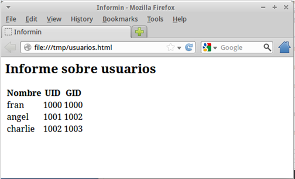
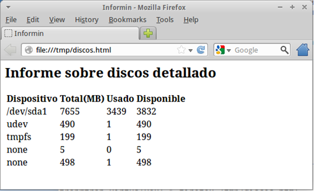
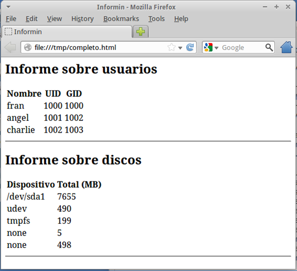

## Descripción

Los administradores de sistemas necesitan en muchas ocasiones recabar información sobre el sistema para conocer el estado del mismo: capacidad de los discos, número de usuarios del sistema, usuarios conectados, nivel de ejecución actual y anterior, etc.  Esta tarea necesita de la ejecución de muchos comandos, que el administrador debe repetir cada vez que quiere conocer estos datos.

Este proyecto consiste en elaborar un script para la BASH en GNU/Linux que genere informes, detallados o sencillos, sobre distintos aspectos del sistema ("informin" proviene de la combinación de **INFOR**me y ad**MIN**istrador):

* El nombre del script será `informin.sh`

## Sintaxis

* La sintaxis del script es la siguiente:

```bash
informin.sh [ --help | --usuarios | --discos | --completo ] [ --detallado ]
```

* El funcionamiento del script será el siguiente:

| Opción       | Descripción                              |
| ------------ | ---------------------------------------- |
| `--help`     | Muestra la ayuda, explicando para qué sirve el script, sus distintas opciones y cómo se utiliza. |
| `--usuarios` | Genera un documento en formato HTML con información sobre los usuarios de sistema: nombre, UID y GID. Si se especifica la opción `--detallado`, se incluirá también la Shell y el HOME. |
| `--discos`   | Genera un documento en formato HTML con información sobre los discos de sistema: fichero de dispositivo (p.ej.: `/dev/sda1`) y el espacio total. Si se especifica la opción `--detallado`, se incluirá también el espacio ocupado y el disponible (en MB). |
| `--completo` | Genera un documento HTML con la información de todos los usuarios, los discos, la memoria y los procesos. |
| Sin opciones | Se mostrará un menú que permitirá seleccionar el informe que se quiere generar (Usuarios, Discos, Memoria, Procesos o Completo), y luego se pedirá si se quiere detallado o no. |

> En todas las opciones, tras generar el informe, éste se abrirá con Firefox:
>
> `$ firefox /tmp/<informe>.html`

> Los documentos HTML se generarán en el directorio temporal `/tmp,` y se eliminarán al cerrar `firefox`.

> Se tendrá en cuenta que se verifiquen los parámetros especificados por el usuario y se controlen, en la medida de lo posible, los errores.

## Ejemplos

### Informe de usuarios

```bash
$ ./informin.sh --usuarios
```

Suponiendo que:

```bash
$ cat /etc/passwd 
[...]
fran:x:1000:1000:Fran,,,:/home/fran:/bin/bash
angel:x:1001:1002::/home/angel:/bin/bash
charlie:x:1002:1003::/home/charlie:/bin/bash
```

El contenido del informe generado (`/tmp/usuarios.html`) sería:

```html
<html>
  <head><title>Informin</title></head>
  <body>
    <h2>Informe sobre usuarios </h2>
    <table>
      <tr><th>Nombre</th><th>UID</th><th>GID</th></tr>
      [...]
      <tr><td>fran</td><td>1000</td><td>1000</td></tr>
      <tr><td>angel</td><td>1001</td><td>1002</td></tr>
      <tr><td>charlie</td><td>1002</td><td>1003</td></tr>
    </table>
  </body>
</html>
```

Y al abrirse Firefox veríamos lo siguiente:



### Informe de usuarios detallado

```bash
$ ./informin.sh --usuarios --detallado
```

El contenido del informe generado (`/tmp/usuarios.html`) sería:

```html
<html>
  <head><title>Informin</title></head>
  <body>
  	<h2>Informe sobre usuarios detallado</h2>
  	<table>
        <tr><th>Nombre</th><th>UID</th><th>GID</th><th>Shell</th><th>Home</th></tr>
        [...]
        <tr><td>fran</td><td>1000</td><td>1000</td><td>/bin/bash</td><td>/home/fran</td></tr>
        <tr><td>angel</td><td>1001</td><td>1002</td><td>/bin/bash</td><td>/home/angel</td></tr>
        <tr><td>charlie</td><td>1002</td><td>1003</td><td>/bin/bash</td><td>/home/charlie</td></tr>
    </table>
  </body>
</html>
```

### Informe de discos

```bash
$ ./informin.sh --discos
```

Suponiendo que:

```bash
$ df –m
S.ficheros     1M-bloques Usado Disponible Uso% Montado en
/dev/sda1            7655  3439       3832  48% /
udev                  490     1        490   1% /dev
tmpfs                 200     1        199   1% /run
none                    5     0          5   0% /run/lock
none                  498     1        498   1% /run/shm
```

El contenido del informe generado (`/tmp/discos.html`) sería:

```html
<html>
  <head><title>Informin</title></head>
  <body>
    <h2>Informe sobre discos</h2>
    <table>
      <tr><th>Dispositivo</th><th>Total (MB)</th></tr>
      <tr><td>/dev/sda1</td><td>7655</td></tr>
      <tr><td>udev</td><td>490</td></tr>
      <tr><td>tmpfs</td><td>199</td></tr>
      <tr><td>none</td><td>5</td></tr>
      <tr><td>none</td><td>498</td></tr>
    </table>
  </body>
</html>
```

### Informe de discos detallado

```bash
$ ./informin.sh --discos --detallado
```

El contenido del informe generado sería:

```html
<html>
  <head><title>Informin</title></head>
  <body>
    <h2>Informe sobre discos detallado</h2>
    <table>
      <tr><th>Dispositivo</th><th>Total(MB)</th><th>Usado</th><th>Disponible</th></tr>
      <tr><td>/dev/sda1</td><td>7655</td><td>3439</td><td>3832</td></tr>
      <tr><td>udev</td><td>490</td><td>1</td><td>490</td></tr>
      <tr><td>tmpfs</td><td>199</td><td>1</td><td>199</td></tr>
      <tr><td>none</td><td>5</td><td>0</td><td>5</td></tr>
      <tr><td>none</td><td>498</td><td>1</td><td>498</td></tr>
    </table>
  </body>
</html>
```

Y al abrirse Firefox veríamos lo siguiente:



### Informe completo

```bash
$ ./informin.sh --completo
```

El contenido del informe generado sería:

```html
<html>
  <head><title>Informin</title></head>
  <body>
    <h2>Informe sobre usuarios</h2>
    <table>
      <tr><th>Nombre</th><th>UID</th><th>GID</th></tr>
      [...]
      <tr><td>fran</td><td>1000</td><td>1000</td></tr>
      <tr><td>angel</td><td>1001</td><td>1002</td></tr>
      <tr><td>charlie</td><td>1002</td><td>1003</td></tr>
    </table>
    <hr>
    <h2>Informe sobre discos</h2>
    <table>
      <tr><th>Dispositivo</th><th>Total (MB)</th></tr>
      <tr><td>/dev/sda1</td><td>7655</td></tr>
      <tr><td>udev</td><td>490</td></tr>
      <tr><td>tmpfs</td><td>199</td></tr>
      <tr><td>none</td><td>5</td></tr>
      <tr><td>none</td><td>498</td></tr>
    </table>
    <hr>
  </body>
</html>
```

### Informe completo detallado

```bash
$ ./informin.sh --completo --detallado
```

El contenido del informe generado sería:

```html
<html>
  <head><title>Informin</title></head>
  <body>
    <h2>Informe sobre usuarios detallado</h2>
    <table>
      <tr><th>Nombre</th><th>UID</th><th>GID</th><th>Shell</th><th>Home</th></tr>
      [...]
      <tr><td>fran</td><td>1000</td><td>1000</td><td>/bin/bash</td><td>/home/fran</td></tr>
      <tr><td>angel</td><td>1001</td><td>1002</td><td>/bin/bash</td><td>/home/angel</td></tr>
      <tr><td>charlie</td><td>1002</td><td>1003</td><td>/bin/bash</td><td>/home/charlie</td></tr>
    </table>
    <hr>
    <h2>Informe sobre discos detallado</h2>
    <table>
      <tr><th>Dispositivo</th><th>Total(MB)</th><th>Usado</th><th>Disponible</th></tr>
      <tr><td>/dev/sda1</td><td>7655</td><td>3439</td><td>3832</td></tr>
      <tr><td>udev</td><td>490</td><td>1</td><td>490</td></tr>
      <tr><td>tmpfs</td><td>199</td><td>1</td><td>199</td></tr>
      <tr><td>none</td><td>5</td><td>0</td><td>5</td></tr>
      <tr><td>none</td><td>498</td><td>1</td><td>498</td></tr>
      <hr>
    </table>
  </body>
</html>
```

Y al abrirse Firefox veríamos lo siguiente:




## Calificación

| Apartado           | Funcionalidad                            | Peso (%) |
| ------------------ | ---------------------------------------- | :------: |
| Sin opciones       | Mostrar un menú que permita elegir el informe y el detalle. |    20    |
| Opción --help      | Mostrar la ayuda del comando.            |    10    |
| Opción --usuarios  | Mostrar un informe sobre los usuarios.   |    15    |
| Opción --discos    | Mostrar un informe sobre los discos.     |    15    |
| Opción --completo  | Mostrar un informe completo: usuarios y discos. |    20    |
| Opción --detallado | Generar informe con más nivel de detalle en cada opción. |    20    |
