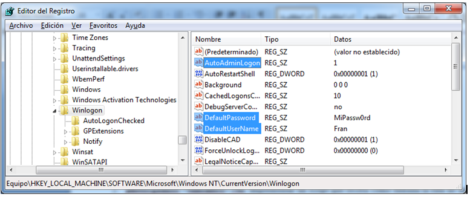

Normalmente, cuando iniciamos el equipo, el sistema nos pide las credenciales del usuario con el que queremos iniciar sesión. Sin embargo, es posible configurarlo para que se inicie sesión automáticamente (autologin) con un usuario determinado, y esta configuración de “autologin” se debe establecer mediante el Registro de Windows. 

El Registro de Windows es una base de datos jerárquica formada por **claves** y **valores**. Las claves son como carpetas que contienen los valores. Los valores tienen un nombre, un tipo de datos y un valor en sí mismo.

Para configurar el inicio de sesión automático es necesario utilizar los siguiente valores de la clave `HKLM:\SOFTWARE\Microsoft\Windows NT\CurrentVersion\Winlogon`:

| Valor o Propiedad | Tipo     | Descripción                                                  |
| ----------------- | -------- | ------------------------------------------------------------ |
| `AutoAdminLogon`  | `REG_SZ` | Si vale `1` = autologin activado.  Si vale `0` = autologin desactivado.  Si no existe, está desactivado. |
| `DefaultUserName` | `REG_SZ` | Nombre de usuario con el que se iniciará sesión automáticamente. |
| `DefaultPassword` | `REG_SZ` | Contraseña del usuario con el que se iniciará sesión automáticamente. En texto plano (sin encriptar). |



> `HKLM` es la abrevitura de `HKEY_LOCAL_MACHINE`.

Este proyecto consiste en implementar un script para el PowerShell de Windows que permita comprobar si el "autologin" está habilitado, así como habilitarlo o deshabilitarlo.

* El nombre del script será `Config-AutoLogin.ps1`.

## Sintaxis

La sintaxis del script es la siguiente:

```powershell
Config-AutoLogin.ps1 [ -Help | -Check | -Enable [-Username usuario] [-Password contraseña] | -Disable ]
```

El funcionamiento del script será el siguiente:

| Opción     | Descripción                                                  |
| ---------- | ------------------------------------------------------------ |
| `-Help`    | Muestra la ayuda de sí mismo: `Get-Help .\Config-AutoLogin.ps1` |
| `-Check `  | Comprueba si el autologin está activado (`AutoAdminLogon=1`), y en caso afirmativo muestra el nombre del usuario para el que está activado. Sino, se debe indicar que no está activado. |
| `-Enable`  | Habilita el autologin (`AutoAdminLogon=1`), establece el usuario con el que se inciará sesión (`DefaultUserName=usuario`) y su contraseña (`DefaultPassword=contraseña`). Si los valores del registro no existen, habrá que crearlos. Si no se especifica el parámetro `-Username`, se pedirá al usuario que lo introduzca. Si no se especifica el parámetro `-Password`, se pedirá al usuario que lo introduzca como una cadena segura (SecureString). |
| `-Disable` | Deshabilita el autologin (`AutoAdminLogon=0`), y elimina los valores `DefaultUserName` y `DefaultPassword`. |

> El script deberá contener los comentarios de ayuda de PowerShell, de forma que se muestre toda la información del mismo con `Get-Help`.

### Ejemplos de uso

Suponiendo que hay un pendrive en la unidad `E:` conteniendo el fichero `autorun.inf` anterior y otro en la unidad `F:` sin éste fichero.

```powershell
# Muestra la ayuda del script
PS> .\Config-AutoLogin.ps1 -Help
# ó
PS> Get-Help .\Config-AutoLogin.ps1

# Comprueba si el autologin está habilitado
PS> .\Config-AutoLogin.ps1 -Check
El inicio de sesión automático no está habilitado.

# Habilita el autologin
PS> .\Config-AutoLogin.ps1 -Enable
Introduzca el nombre del usuario: perico
Introduzca la contraseña: ****
Se ha habilitado el inicio de sesión automático para el usuario perico.

# Comprueba si el autologin está habilitado
PS> .\Config-AutoLogin.ps1 -Check
El inicio de sesión automático está habilitado para el usuario perico.

# Deshabilita el autologin
PS> .\Config-AutoLogin.ps1 -Disable
Se ha deshabilitado el inicio de sesión automático.

# Habilita de nuevo el autologin
PS> .\Config-AutoLogin.ps1 -Enable -Usuario perico
Introduzca la contraseña: ****
Se ha habilitado el inicio de sesión automático para el usuario perico.
```

### Pistas

Para obtener todos los valores de una clave:

```powershell
PS> Get-ItemProperty -Path clave
```

Para obtener un valor:

```powershell
PS> Get-ItemProperty -Path clave -Name valor
```

Para comprobar si un valor existe:

```powershell
$ErrorActionPreference = "Stop"
try {
    Get-ItemProperty -Path clave -Name valor | Out-Null
	$existe = $true
} catch [System.Management.Automation.PSArgumentException] {
	$existe = $false
}
```

Para obtener el dato almacenado en un valor:

```powershell
PS> (Get-ItemProperty -Path clave -Name valor).valor
```

Para crear un valor nuevo:

```powershell
PS> New-ItemProperty -Path clave -Name valor -PropertyType tipo -Value dato | Out-Null
```

>  Donde `tipo` puede ser `String`, `Boolean`, `ExpandString`, `Binary`, `DWord`, `MultiString`, `QWord`, `Unknown`.

Para modificar un valor existente:

```powershell
PS> Set-ItemProperty -Path clave -Name valor -Value dato
```

Para eliminar un valor existente:

```powershell
PS> Remove-ItemProperty -Path clave -Name valor
```

> Aclaración:
>
> * `clave` es la ruta completa a la clave dentro del Registro de Windows.
>
>
> * `valor` es el nombre del valor o propiedad dentro de la clave.

## Calificación

| Opción   | Funcionalidad                                | Peso (%) |
| -------- | -------------------------------------------- | :------: |
| -Help    | Mostrar la ayuda.                            |    10    |
| -Check   | Comprobar si el "autologin" está habilitado. |    30    |
| -Enable  | Habilitar el "autologin".                    |    45    |
| -Disable | Deshabilitar "autologin"                     |    15    |