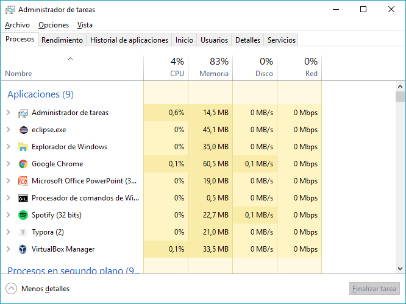
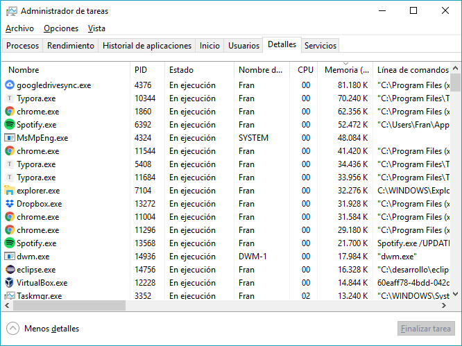
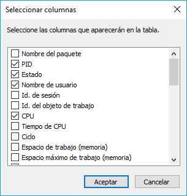

# Procesos en Windows

## Administrador de Tareas

- Programa utilizado para conocer los procesos y programas que se están ejecutando en Windows, así como el estado de los mismos.

- También podemos utilizarlo para terminar procesos, suspenderlos, cambiar su prioridad,cambiar su afinidad, etc. 

### Formas de iniciarlo

Distintas formas de iniciar el "Administrador de tareas" de Windows:

- Pulsando la combinación de teclas `CTRL+ALT+SUPR` y seleccionando “Administrador de tareas”.
- Pulsando la combinación de teclas `CTRL+MAYUS+ESC`.
- Desde la ventana “Ejecutar…” (`WIN+R`) escribiendo `taskmgr.exe` y pulsando “Ejecutar”.
- Botón derecho sobre la barra de tareas o el botón de “Inicio”, opción “Administrador de tareas”.

### Información sobre los procesos

* En la pestaña “Procesos” del “Administrador de tareas” disponemos de la vista sencilla de procesos.
* Los procesos aparecen agrupados: Aplicaciones, Segundo plano, Servicios, ...

:warning: Algunas versiones de Windows muestran `*32` junto al nombre el proceso, indicando que se tarat de una aplicación para microprocesadores de 32 bits.

~

### Información detallada

* En la pestaña "Detalles" del "Administrador de tareas" disponemos de la vista clásica de procesos, con másdetalles.

* **Mostrar más información:** Pulsamos el botón secundario del ratón sobre los encabezados y seleccionamos la opción “Seleccionar columnas”.

