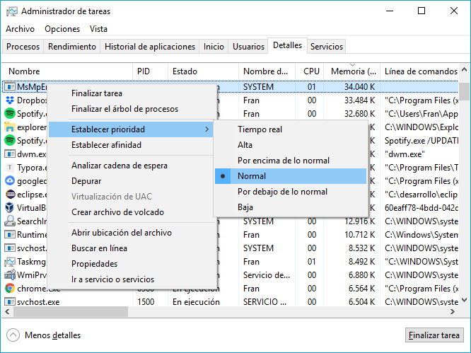
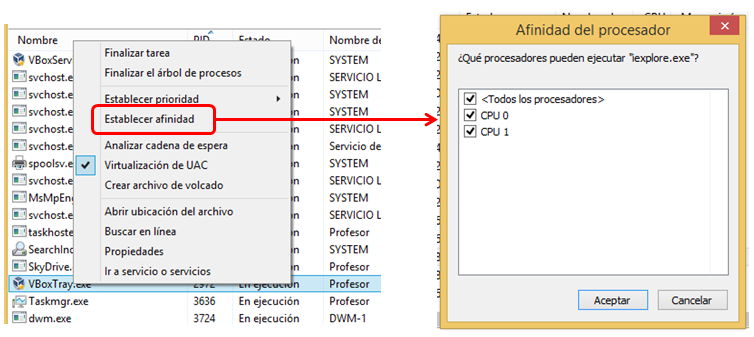
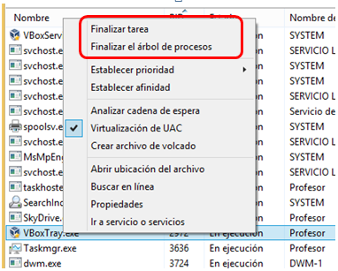

# Procesos en Windows

## Administrador de Tareas

- Programa utilizado para conocer los procesos y programas que se están ejecutando en Windows, así como el estado de los mismos.


- También podemos utilizarlo para terminar procesos, suspenderlos, cambiar su prioridad,cambiar su afinidad, etc. 

### Formas de iniciarlo

Distintas formas de iniciar el "Administrador de tareas" de Windows:

- Pulsando la combinación de teclas `CTRL+ALT+SUPR` y seleccionando “Administrador de tareas”.
- Pulsando la combinación de teclas `CTRL+MAYUS+ESC`.
- Desde la ventana “Ejecutar…” (`WIN+R`) escribiendo `taskmgr.exe` y pulsando “Ejecutar”.
- Botón derecho sobre la barra de tareas o el botón de “Inicio”, opción “Administrador de tareas”.


### Información sobre los procesos

* En la pestaña “Procesos” del “Administrador de tareas” disponemos de la vista sencilla de procesos.
* Los procesos aparecen agrupados: Aplicaciones, Segundo plano, Servicios, ...


⚠️ Algunas versiones de Windows muestran `*32` junto al nombre el proceso, indicando que se tarat de una aplicación para microprocesadores de 32 bits.

### Información detallada

* En la pestaña "Detalles" del "Administrador de Tareas" disponemos de la vista clásica de procesos, con más detalles.


* **Mostrar más información:** Pulsamos el botón secundario del ratón sobre los encabezados y seleccionamos la opción “Seleccionar columnas”.


### Cambiar la prioridad de un proceso

Botón secundario del ratón sobre el proceso > Establecer prioridad > Seleccionamos la prioridad deseada:



### Cambiar la afinidad de un proceso

* En microprocesadores de varios núcleos o en equipos multiprocesador es posible indicar para cada proceso en que núcleo(s) o micros se debe ejecutar (eso es la“afinidad”).
* Botón secundario del ratón sobre el proceso > Establecer afinidad.



### Terminar un proceso

* Matar un proceso (y sus subprocesos); forzar la terminación de una aplicación.

* Pestaña "Detalles" > botón secundario del ratón sobre el proceso > "Finalizar tarea" / "Finalizar el árbol de procesos".

  

### Ubicación del ejecutable

* Conocer donde se encuentra almacenado en disco el archivo ejecutable que inició el proceso.
* Pestaña "Detalles" > Botón secundario del ratón sobre el proceso > “Abrir ubicación delarchivo”.


## Administrar procesos desde el Símbolo del sistema (CMD)

### El comando "tasklist"

Comando que permite listar los procesos desde el Símbolo del sistema (CMD).

```bash
CMD> tasklist

Nombre de imagen               PID Nombre de sesión Núm. de ses Uso de memor
========================= ======== ================ =========== ============
System Idle Process              0 Services                   0         8 KB
System                           4 Services                   0     1.116 KB
smss.exe                       388 Services                   0       104 KB
csrss.exe                      516 Services                   0       804 KB
wininit.exe                    632 Services                   0       236 KB
csrss.exe                      640 Console                    1     1.604 KB
services.exe                   708 Services                   0     4.620 KB
lsass.exe                      716 Services                   0     8.108 KB
svchost.exe                    820 Services                   0       248 KB
svchost.exe                    844 Services                   0    16.148 KB
fontdrvhost.exe                864 Services                   0       436 KB
winlogon.exe                   936 Console                    1     1.848 KB
fontdrvhost.exe                988 Console                    1     1.784 KB
svchost.exe                    356 Services                   0     9.556 KB
svchost.exe                    556 Services                   0     3.492 KB
[...]
```

#### Filtros

Es posible usar filtros con el comando `tasklist`, de forma que sólo se listarán los procesos que cumplan los criterios especificados:

| Nombre      | Operadores             | Descripción                              |
| ----------- | ---------------------- | ---------------------------------------- |
| STATUS      | eq, ne                 | Estado del proceso: RUNNING, NOT RESPONDING, UNKNOWN |
| IMAGENAME   | eq, ne                 | Nombre del ejecutable (binario).         |
| PID         | eq, ne, gt, lt, ge, le | Identificador del proceso.               |
| SESSION     | eq, ne, gt, lt, ge, le | Número de sesión.                        |
| SESSIONNAME | eq, ne                 | Nombre de la sesión.                     |
| CPUTIME     | eq, ne, gt, lt, ge, le | Tiempo de uso de CPU en formato HH:MM:SS. |
| MEMUSAGE    | eq, ne, gt, lt, ge, le | Uso de memoria en KiB.                   |
| USERNAME    | eq, ne                 | Nombre de usuario.                       |
| SERVICES    | eq, ne                 | Nombre de servicio.                      |
| WINDOWTITLE | eq, ne                 | Título de la ventana.                    |
| MODULES     | eq, ne                 | Nombre de la DLL (librería de enlace dinámico). |

El significado de los operadores es el siguiente:

| Operador | Descripción |
| -------- | ----------- |
| eq       | =           |
| ne       | <>          |
| gt       | >           |
| lt       | <           |
| ge       | >=          |
| le       | <=          |

#### Ejemplos

Listar los procesos que NO son del usuario SYSTEM:

```shell
CMD> tasklist /fi "USERNAME ne SYSTEM"
```

Listar los procesos en ejecución:

```shell
CMD> tasklist /fi "STATUS eq RUNNING"
```

Listar los procesos cuyo ejecutable sea "cmd.exe":

```shell
CMD> tasklist /fi "IMAGENAME eq cmd.exe"
```

Lista el proceso con PID 1234:

```shell
CMD> tasklist /fi "PID eq 1234"
```

Listar los procesos que llevan más de 2 horas de uso de CPU y que pertenezcan al usuario "fran":

```shell
CMD> tasklist /fi "CPUTIME ge 2:00:00" /fi "USERNAME eq fran"
```

### El comando "taskkill"

Permite matar procesos desde el Símbolo del sistema (CMD).

Sintaxis:

```
taskkill [/f] /pid <pid>
taskkill [/f] /fi<filtro>
```

:information_source: `<filtro>` sigue el mismo formato que los [filtros](#filtros)  de `tasklist`.

:information_source: `/f` fuerza el cierre.

#### Ejemplos

Mata el proceso con PID 1234:

```shell
CMD> taskkill /pid 1234
```

Mata todos los procesos cuyo ejecutable sea "cmd.exe":

```shell
CMD> tasklist /fi "IMAGENAME eq cmd.exe"
```

## Administrar procesos desde PowerShell (PS)

### Get-Process

Cmdlet que permite obtener información sobre los procesos del sistema.

| Orden                      | Descripción                              |
| -------------------------- | ---------------------------------------- |
| Get-Process                | Devuelve todos los procesos.             |
| Get-Process -Id <pid>      | Devuelve el proceso con el PID indicado. |
| Get-Process -Name <nombre> | Devuelve el proceso con el nombre indicado. Se pueden usar los comodines `*` y `?`. |

#### Ejemplos

Listar los procesos cuyo nombre empiece por "note":

```powershell
PS> Get-Process -Name note*
```

Listar los procesos cuyo nombre acabe en "ator":

```powershell
PS> Get-Process -Name *ator
```

Listar los procesos con PID 12 y 35:

```powershell
PS> Get-Process -Id 12,35
```

### Stop-Process

Cmdlet que permite matar los procesos del sistema.

| Orden                       | Descripción                              |
| --------------------------- | ---------------------------------------- |
| Stop-Process -Id <pid>      | Elimina el proceso con el PID indicado.  |
| Stop-Process -Name <nombre> | Elimina el proceso con el nombre indicado. Se puede usar el comodín `*`. |

:information_source: Es posible utilizar los modificadores `-WhatIf` y `-Confirm`.

#### Ejemplos

Matar al proceso con PID 1234:

```powershell
PS> Stop-Process -Id 1234
```

Matar los procesos con nombre "notepad":

```powershell
PS> Stop-Process -Name notepad
```

Matar los procesos cuyo nombre empieza en "note" o acaba en "ator":

```powershell
PS> Stop-Process -Name note*,*ator
PS> Get-Process -Name note*,*ator | Stop-Process
```

Mostrar los procesos que se matarían si se ejecutase el comando:

```powershell
PS> Get-Process | Stop-Process -WhatIf
```

### Cambiar la prioridad

Se puede establecer la prioridad de un proceso a través de la propiedad `PriorityClass` de los objetos de tipo "Process" devueltos por el cmdlet `Get-Process`.

```powershell
PS> $proceso = Get-Process -Id 1234
PS> $proceso.PriorityClass = [System.Diagnostics.ProcessPriorityClass]::<prioridad>
```

Donde `prioridad` puede ser:

| Valor       | Descripción                     |
| ----------- | ------------------------------- |
| RealTime    | Tiempo real (máxima prioridad). |
| High        | Alta.                           |
| AboveNormal | Por encima de lo normal.        |
| Normal      | Normal.                         |
| BelowNormal | Por debajo de lo normal.        |
| Idle        | Baja.                           |

### Tareas en segundo plano

Otros commandlets relacionados con la gestión de los procesos en segundo plano en PowerShell son los siguientes:

| Cmdlet      | Descripción                              |
| ----------- | ---------------------------------------- |
| Get-Job     | Devuelve los trabajos en segundo plano iniciados desde PS. |
| Start-Job   | Inicia un trabajo en segundo plano vinculado a la sesión de PS actual. |
| Stop-Job    | Detiene un trabajo en segundo plano vinculado a la sesión de PS actual. |
| Receive-Job | Obtiene el resultado de la ejecución del trabajo en segundo plano. |
| Wait-Job    | Espera a que termine un trabajo determinado. |

